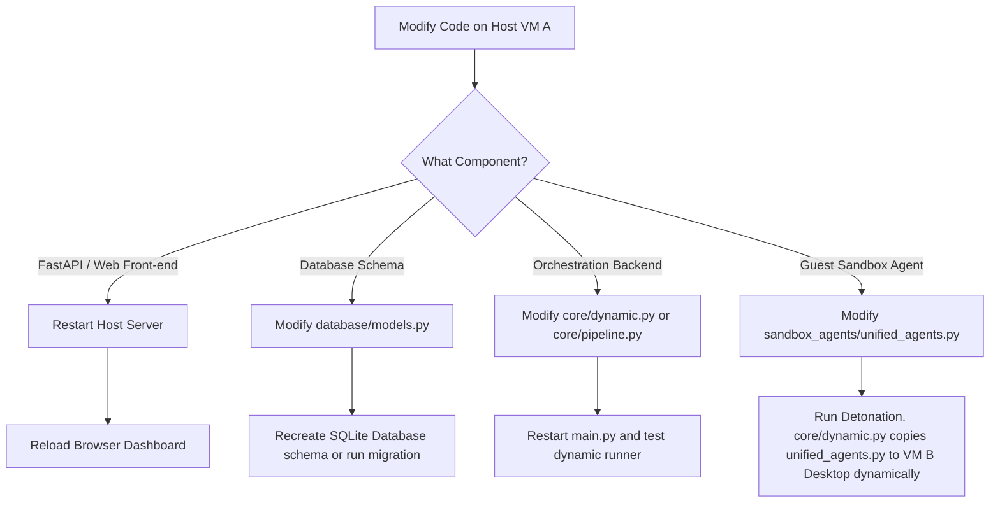

# MARS Sandbox Setup & Development Flow Guide

This document outlines the architecture, the development workflow for making changes to the Malware Analysis & Reporting System (MARS), and the complete installation and configuration guide for setting up the nested guest VM (Sandbox VM B) inside the controller host VM (VM A) in an airgapped environment.

---

## 1. Development & Change Flow

When working on MARS, changes are distributed across the web dashboard, the database schema, the orchestration backend, and the guest VM telemetry agent. Understanding the flow of these components is crucial for successful development.

### Component Map

* **Web UI / Front-end**: Located in `web/` (HTML pages, CSS styling, Javascript event handlers). It runs fully client-side and communicates with the FastAPI endpoints.
* **FastAPI Backend / API Routing**: Located in `api/` (API endpoints, background task triggers, route handling).
* **Database Models**: Located in `database/` (SQLAlchemy schemas, models, and PyPubSub subscribers).
* **Orchestration Backend**: Located in `core/` (core static analysis engines, packet capture sniffing, VMware automation hooks).
* **Guest Sandbox Agent**: Located in `sandbox_agents/unified_agents.py` (the script executed inside the sandbox VM B to monitor file, registry, and memory changes).

---

### Step-by-Step Flow for Making Changes



#### Modifying the Guest Sandbox Agent (`sandbox_agents/unified_agents.py`)
1. **Edit on Host**: You **do not** need to log into VM B (the Sandbox Guest) to edit the agent. Edit `sandbox_agents/unified_agents.py` directly on Host VM A.
2. **Dynamic Copying**: When you trigger a dynamic detonation in MARS, `core/dynamic.py` executes `vmrun.exe copyFileFromHostToGuest` to transfer the updated `sandbox_agents/unified_agents.py` directly onto the Sandbox VM's Desktop before execution.
3. **VM Restoration**: Because VM B is reverted to a clean snapshot (`Clean_State`) before every detonation, any old file copies inside VM B are wiped. The updated agent is freshly copied and run on every detonation.

#### Modifying the Orchestration Engine (`core/dynamic.py`)
1. Edit the automation routines (e.g., `vmrun` flags, named pipe communication, timeouts).
2. Stop the running FastAPI backend server on Host VM A:
   ```powershell
   # In terminal
   Ctrl + C
   ```
3. Start the server again to apply the python changes:
   ```powershell
   python main.py
   ```

#### Modifying Database Schema (`database/models.py`)
1. Update database models or tables in [database/models.py](file:///c:/Users/HP/OneDrive/Desktop/CyberSec/M_A_R_S/database/models.py).
2. If necessary, delete the old SQLite database file `mars_history.db` to let the system auto-recreate the schema upon restarting, or run an Alembic migration.

---

## 2. Airgapped Nested Sandbox VM Setup Guide

In a high-security environment, the development/analysis host (VM A) is running nested inside a bare-metal hypervisor, and the detonation VM (VM B) is nested inside VM A. Since the environment is completely airgapped, there is zero internet connectivity.

### Prerequisites (Airgapped Offline Prep)
Since you cannot download packages from the internet inside the airgapped environment, you must copy the following setup artifacts into the VM A environment:
- **Python Installers**: Python 3.12 (for Host VM A) and Python 3.9 (for Guest Sandbox VM B).
- **Offline Pip Dependencies**: Run `pip download -r requirements.txt -d offline_packages/` on a connected machine, and transfer them into VM A.
- **Sysinternals ProcMon.exe**: Downloaded and packaged in a folder named `C:\Tools\` on VM B.
- **VMware Workstation Pro Installer** installed on Host VM A.

---

### Step 1: Enable Nested Virtualization on VM A (Host VM)
Because VM B is nested inside VM A, the physical CPU's virtualization features (VT-x/AMD-V) must be passed through VM A down to VM B.

1. Power off **VM A**.
2. Open VM A's settings in the primary host hypervisor (e.g., VMware ESXi, Workstation, or Proxmox).
3. Under **Processors**, enable:
   - **Virtualize Intel VT-x/EPT or AMD-V/RVI** (Nested Virtualization).
4. Save and start **VM A**.

---

### Step 2: Configure Virtual Network Editor on VM A (VMware Workstation)
To capture network traffic from VM B, VM A's Scapy sniffer listens on a dedicated **Host-Only** network adapter.

1. Open **VMware Workstation** on VM A as **Administrator**.
2. Go to **Edit → Virtual Network Editor**.
3. Choose or add **VMnet1** (Host-Only type).
4. Check **"Connect a host virtual adapter to this network"**.
5. Set Subnet IP: `192.168.10.0` with Subnet Mask `255.255.255.0`.
6. Click **Apply** and **OK**.
7. Confirm that VM A has a network interface called `VMware Virtual Ethernet Adapter for VMnet1` with an IP like `192.168.10.1`.

---

### Step 3: Create and Configure Guest VM B (Sandbox)
1. In VMware Workstation on VM A, click **File → New Virtual Machine**.
2. Configure settings:
   - **Hardware Compatibility**: Workstation 17.x
   - **OS**: Windows 10 x64
   - **Name**: `Windows10_Sandbox`
   - **Processors**: `2 Cores` (Must be at least 2 to bypass malware anti-sandbox checks)
   - **Memory**: `4096 MB`
3. Add Virtual Hardware:
   - **Network Adapter 1**: Set to **Host-Only (VMnet1)**.
   - **Serial Port**: Click **Add...** → **Serial Port**.
     - Connection Type: **Use named pipe**
     - Named pipe path: `\\.\pipe\sandbox_serial`
     - Status options: **This end is the server**, **The other end is a virtual machine**.
     - Check: **"Yield CPU on poll"**.
4. Install Windows 10 OS on VM B.

---

### Step 4: Configure the Guest OS (VM B Setup)
Boot VM B and execute the following configuration steps before capturing the snapshot.

#### 1. Setup Local Administrator
Create or rename the default user to `Administrator` with password `Password123` (matching the settings in [config/config.yaml](file:///c:/Users/HP/OneDrive/Desktop/CyberSec/M_A_R_S/config/config.yaml)):
```powershell
net user Administrator Password123 /add
net localgroup administrators Administrator /add
```

#### 2. Configure Static IP on VMnet1 Adapter
Open Network connections in VM B and edit the VMnet1 network adapter settings:
- **IP Address**: `192.168.10.20`
- **Subnet Mask**: `255.255.255.0`
- **Default Gateway**: `192.168.10.1` (Points to VM A's Host Adapter)
- **DNS Server**: Leave blank or set to `192.168.10.1`.

#### 3. Install Python 3.9
Run the Python 3.9 installer:
- Install to **exactly** `C:\Python39\`
- Ensure "Add Python to environment variables" is **checked**.
- Copy the necessary dependencies offline to VM B (e.g. `psutil`, `pyserial`, `watchdog`, `wmi`, `pypiwin32`) and run:
  ```powershell
  C:\Python39\python.exe -m pip install --no-index --find-links=C:\Offline_Packages\ -r requirements.txt
  ```

#### 4. Setup ProcMon and Tools Directory
- Create directory `C:\Tools\` and place `procmon.exe` there.
- Create directory `C:\Analysis\` (where traces are output).

#### 5. Disable Antivirus (Evasion Prevention)
Disable Windows Defender to prevent Windows from deleting the copied malware samples during detonation:
- Turn off **Real-time Protection** and **Cloud-delivered Protection**.
- Disable Defender entirely via Group Policy or Registry Editor.

#### 6. Install VMware Tools
- In VMware Workstation menu: **VM → Install VMware Tools**.
- Follow the prompt inside VM B to finish installation and restart VM B.

---

### Step 5: Capture the Clean Snapshot
Once VM B is fully configured and idling at the desktop:

1. Close all unnecessary windows on VM B.
2. In VMware Workstation, go to **VM → Snapshot → Take Snapshot**.
3. Name the snapshot **exactly**: `Clean_State` (matches `snapshot_name` config).
4. Save the snapshot.

You can now leave VM B powered off or running. The MARS engine will automatically revert, start, inject the sample, detonate it, collect the telemetry, and shut down the VM on every analysis queue run!
